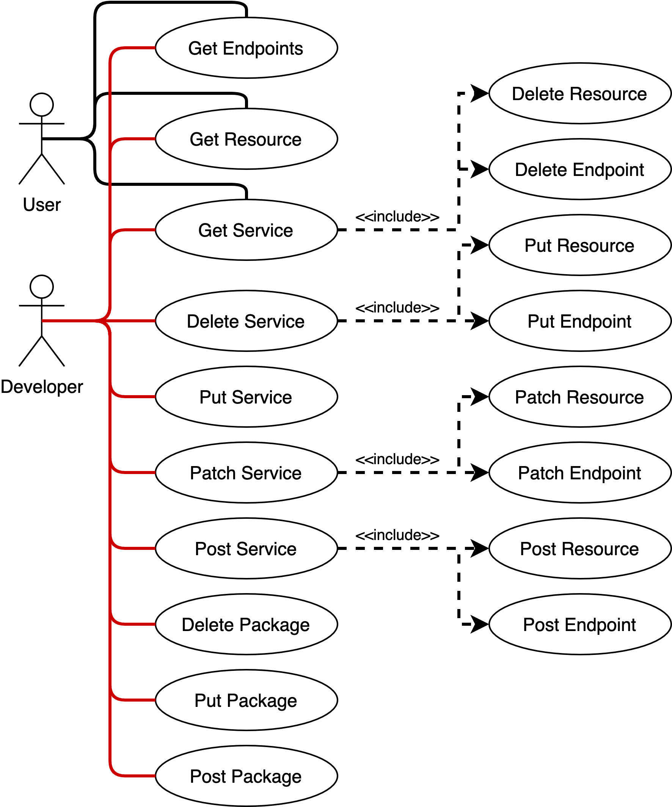
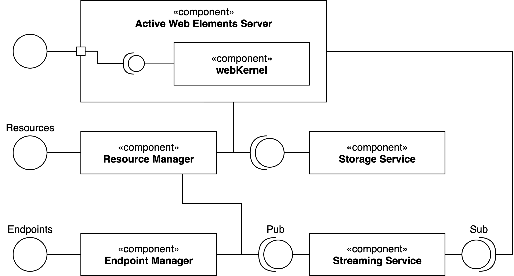
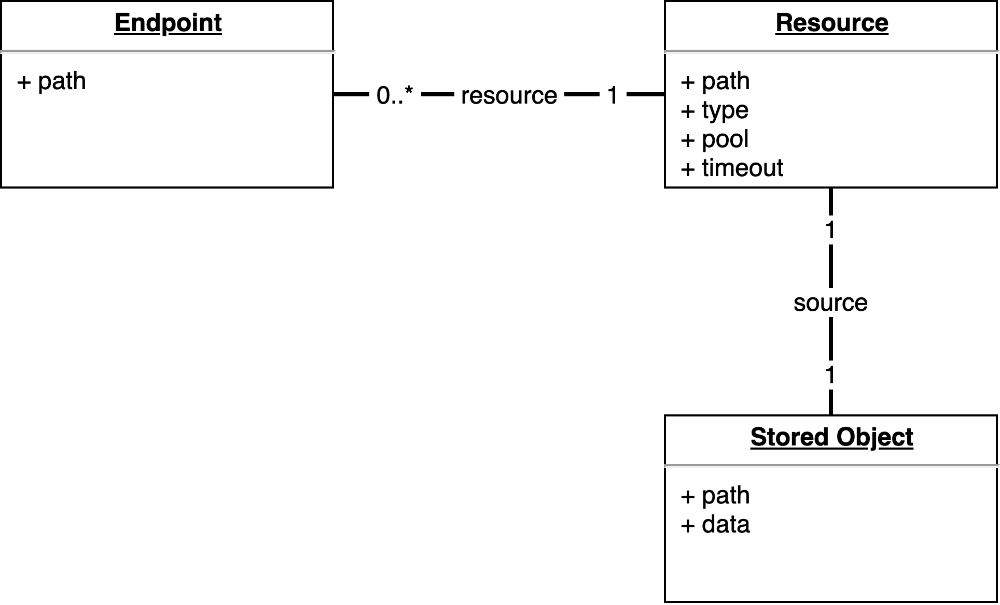
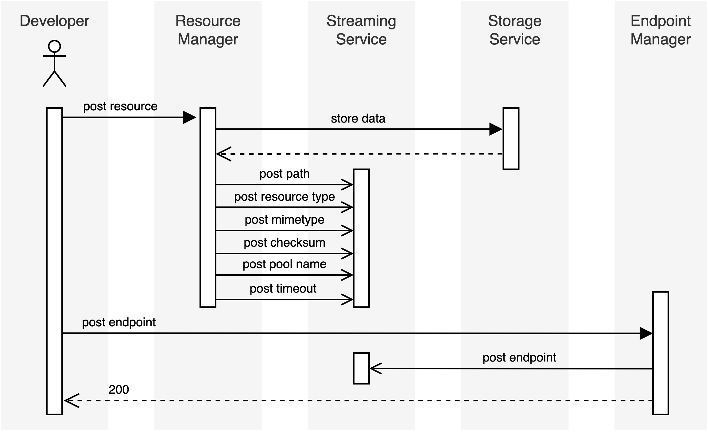
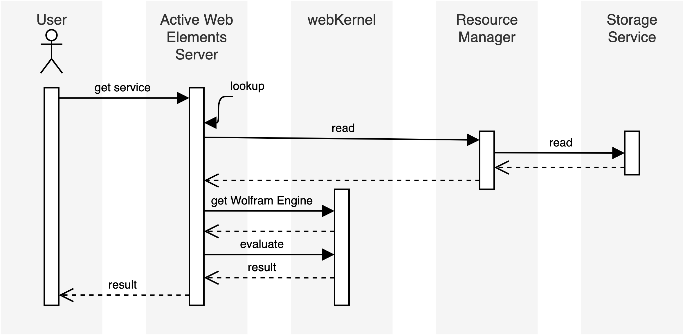
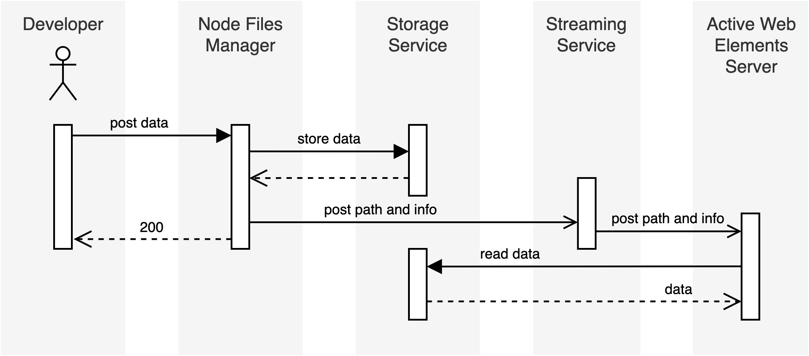

# Wolfram Application Server Architecture
Wolfram Application Server(WAS) is a light weight, clustered server for presenting Wolfram Language content including active web elements and legacy Mathematica servlet pages. It is designed to be fast, scalable, easy to deploy, and easy to maintain and is targeted at customers who want to deploy stateless RESTful web applications written in or leveraging Wolfram Language. The Wolfram Application Server does not support stateful Wolfram Engine sessions or interactive content and cloud notebooks. Customers needing those features should consider the Enterprise Private Cloud.

## Requirements
* Clusterized, scalable, and highly available
* Services can be created and modified at runtime
* Stateless REST interfaces
* Supports Active Web Elements and legacy MSP's
* Minimal configuration for cluster deployment
* Automated cluster management
* Loose coupling between components/micro-services
* Supports multiple implementations for components
* Highly optimized for speed
* The preferred developer client is Wolfram Desktop

## Assumptions
* All user defined services are stateless
* The high volume traffic comes from accessing services
* Services are created or modified with relative infrequency
* The total number of services provided is small enough for all related metadata to be replicated in memory on each node
* Total supported node file content is sufficiently small to be replicated in local storage on each node
* Compute nodes are substitutable
* Only eventual consistency is guaranteed
* User accounts and distinct user data not supported
* All developer created services are public
* Concurrency protection for developer use cases is not needed

## Use Cases
The following diagram describes the key uses cases for clients of the Wolfram Application Server:

Note that the terms used here are taken from the ontology of REST applications. A **service** is a unit of web accessible content addressed by an **endpoint**. The content or source to be computed to generate the content is the **resource** for the service. So users access services through endpoints. Developers deploy and modify resources that are referenced by the endpoints to implement the services users consume. A **node file** is a source files that is not directly addressable by and endpoint because the content is not intended to be directly evaluated. Node files are used to add support files that may be loaded or used by resources as part of their work.

A WAS **user** is defined as an anonymous accessor of any API or an authenticated accessor who has not been assigned any other role in the system. User activities center around discovering and accessing services. A user may get a listing of all available services and get a particular service. The action of getting a service may produce a computed result derived from a Wolfram Language implementation of the resource corresponding to the service. A user may also get a resource to acquire some implementation details like documentation and required and optional query parameters for the calling the service. The full source code for the resource may not be returned for a user.

A WAS **developer** is defined as an actor who can create and publish services in the system. A developer inherits all the use cases for a user and includes new use cases related to publishing. The primary activity for a developer is to create and modify resources on the server and link them to endpoints. This entails defining endpoints and the resource code to be returned or evaluated when accessed by users. The usual CRUD operations are provided for resources. A developer may in addition create and modify node files that are not bound to a particular endpoint but can be accessed by the resources of one or more resources. These files are guaranteed to be stored locally on each node. Node files are useful for sharing code across resources and the developer has access to the usual CRUD operations.

## Primary System Components

### Active Web Elements Server (AWES)
The **Active Web Elements Server** (AWES) affords the developer defined services to end users. It uses Wolfram Engines from the **Web Kernel** component to compute results from user requests. Parameters derived from a user GET or POST request are applied to the source associated with the endpoint resource to provide these results.
### Endpoint Manager
The **Endpoint Manager** affords an interface to developers to define, modify, and delete endpoints in the system. This manager is responsible for updating the internal state of the application server and particularly the active web elements servers to have up to date, consistent endpoint definitions.
### Resource Manager
The **Resource Manager** exposes an interface to define, modify, and delete resources which are referred to by endpoints. Using this interface, developers can define how the resource will be invoked by the Active Web Elements Server and provide the source code to be evaluated. The resource manager is responsible for arranging for the persistent storage of the resource's source code and sending notifications when changes in resource state occur.
### Storage Service
The **Storage Service** provides persistent storage for data associated with resources and access to that source data for interested components. This acts as the source of truth for service configuration in the system.
### Streaming Platform
The Streaming Platform provides reliable chronological message delivery for providers and consumers of message streams.  It also provides replayability of message streams for new component instances created while the cluster is running. The guarantee of replayability allows the streaming platform to act as the source of truth for all state in the system.
### Node Files Manager (not shown)
The **Node Files Manager** component can be used to deploy shared source libraries that may be accessed by multiple resources or other system files used for configuration of components. Node files are acessed directly by the Wolfram Engine and other specific implementations, e.g. Tomcat, and must be accessible from a filesystem mounted on the local host. The node files manager coordinates with other components to deliver local instances of node files.

## Core Data Model

Every deployed service in the application server is represented by an endpoint-resource pair, which define the location of the service and the resource. An endpoint defines and is uniquely identified by a path relative to the server root address. It must contain a reference to exactly one resource (this may be set to a default resource if none is provided on creation or modification) which is addressed by a unique path. The resource encapsulates metadata that specifies how it is to be evaluated by the Active Web Elements Server and a reference to the stored source data that may be used to access it. The source data is the actual code to be evaluated, and there is a one-to-one relationship between a source instance and a resource instance. The path referencing the stored object is an internal implementation detail and is not exposed to the end user. A resource instance may be shared with any number of endpoint instances or none at all.

## Operations Sequences
### Creating a Service

Creating a new service is a two part process that starts with creating a resource. In a POST request a developer submits the resource source code and required metadata to define how it should be evaluated to the resource manager. The resource manager will then call the storage service to write the data to permanent storage. Then the resource manager will post a series of messages in the form of key-value pairs to the streaming service with the relevant metadata for the resource. The key is a concatenation of the unique resource path and the name of the particular value provided, e.g. {path}/type would be the full key for storing the type of the resource identified with path. A success code is then returned to the developer. Now an endpoint is created to address the newly created resource. A POST request is sent to the endpoint manager with the endpoint path and associated resource path. The endpoint manager posts a message to the streaming service defining the resource path associated with the endpoint. The message also follows the convention of prepending the source path to the key. The endpoint manager then returns a success code to the developer. Not shown in this diagram is the streaming service asynchronously forwarding all messages to the consumers which include the active web elements servers.
### Calling a Service

A service is called by sending a GET request for the endpoint path to the active elements web server. The server then looks up the resource metadata referred to by the endpoint. The resource data is fetched from the storage system for future evaluation. The AWES then acquires a kernel from the web kernel manager. The kernel is configured with information related to the HTTP request from the user and subsequently the resource source is submitted for evaluation. The kernel returns the result and is then released. The AWES then returns the computed data to the end user.
### Deploying a Node File

The node file creation process is started when a user submits a post request specifying the file path and the data to be stored. The node files manager first coordinates with the storage service to save the file data in a persistent location. In this example we shall assume that the storage service does not present a network file system interface so there is no mount point directly accessible to other components. Once the data has been stored, the node files manager posts a message to the streaming service on a topic for node file events giving the user specified file path as a key and the location within the storage service as the value. The node files manager then stores this data internally for future reference. The streaming service forwards asynchronously the notification to consumers which in this case are the AWES nodes. On receipt of the notification, the AWES fetches the node files's data from the storage service and stores it locally reflecting the path provided.

# Caching Active Web Elements
After an Active Web Element is created, the user might request it multiple times, so we would like to cache a copy of it on the Active Web Elements Server(s) and reduce the time taken in fetching from storage service where it is permanently stored.

In the above sequence diagram, the activity marked in red is the additional work done for caching. Rest of the flow is as existing.

1. Post Resource File Checksum : MD5 file checksum is calculated by the Resource Manager and sent to the streaming service (Kafka) along with other Resource Info. The Active Web Elements Server on the other side maintains a map of Resource Info (in-memory) which is updated based on updates from streaming service (Kafka).

2. When the user calls GET service we need to determine whether the resurce is cached and valid. If the resource exists in the cache, we compare its MD5 checksum with the latest MD5 checksum for the resource, which we know by listening to Kafka updates (and as stored in the in-memory Resource Info map in AWES). If the checksum matches, we use the resource from the cache.

3. If the cache does not exist or the checksum mismatches, then we get the resource from resource manager and create or update the cache and also checksum map. Proposed directory for caching resources: `/opt/.wolframcache/{resource_path}
`
Once container or Active Web Elements Server is restarted, the cache directory is wiped and it is rebuilt again upon user requests for resources.
