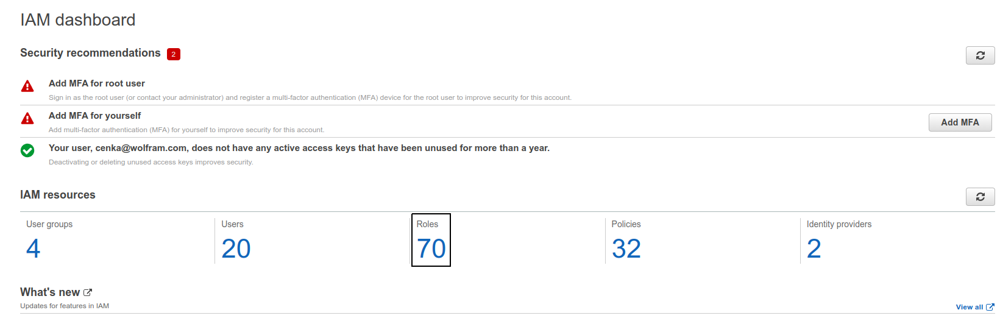
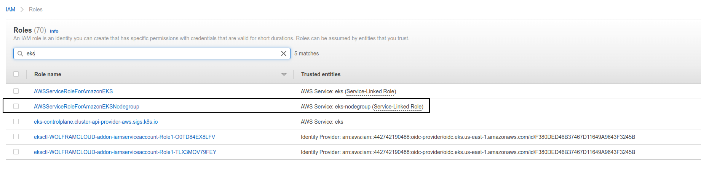
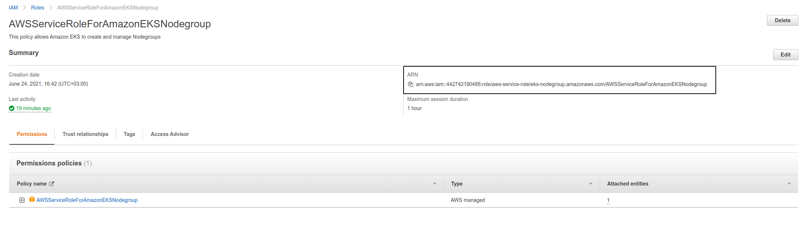

## Adding SSL certificate to AWS WAS

In this document, we will use

- [Nginx Ingress Controller](https://kubernetes.github.io/ingress-nginx/)

- [cert-manager](https://cert-manager.io/docs/installation/)

- [Let's Encrypt](https://letsencrypt.org/)

- [AWS Route 53](https://aws.amazon.com/route53/)

  to create SSL certificate for our WAS cluster.

---

### Install [cert-manager](https://cert-manager.io/docs/installation/)

```bash
kubectl apply -f https://github.com/cert-manager/cert-manager/releases/download/v1.8.0/cert-manager.yaml
```
It's quite straightforward. The version may change over time.

---

### Create a public hosted zone in Route 53

To create a public hosted zone using the Route 53 console

1. Sign in to the AWS Management Console and open the Route 53 console at https://console.aws.amazon.com/route53/.

2. If you're new to Route 53, choose **Get started under DNS management**.

If you're already using Route 53, choose Hosted zones in the navigation pane.

3. Choose **Create hosted zone**.

4. In the Create Hosted Zone pane, enter the name of the domain that you want to route traffic for. You can also optionally enter a comment.

For information about how to specify characters other than a-z, 0-9, and - (hyphen) and how to specify internationalized domain names, see [DNS domain name format](https://docs.aws.amazon.com/Route53/latest/DeveloperGuide/DomainNameFormat.html).

5. For Type, accept the default value of Public Hosted Zone.

6. Choose **Create**.

7. Create records that specify how you want to route traffic for the domain and subdomains. For more information, see [Working with records](https://docs.aws.amazon.com/Route53/latest/DeveloperGuide/rrsets-working-with.html).

8. To use records in the new hosted zone to route traffic for your domain, see the applicable topic:

* If you're making Route 53 the DNS service for a domain that is registered with another domain registrar, see  [Making Amazon Route 53 the DNS service for an existing domain](https://docs.aws.amazon.com/Route53/latest/DeveloperGuide/MigratingDNS.html).

* If the domain is registered with Route 53, see [Adding or changing name servers and glue records for a domain](https://docs.aws.amazon.com/Route53/latest/DeveloperGuide/domain-name-servers-glue-records.html).

---

### Create a Route 53 A record.

The A record points to the Network Load Balancer created by NGINX Ingress Controller.

1. On the **Amazon Elastic Compute Cloud (Amazon EC2) console**, choose **Load Balancer**, and then copy the **Network Load Balancer’s DNS name**.

2. On the Amazon Route 53 console, choose **Public Hosted Zone**, choose **Create record**, and then enter a name for the record. 

3. Choose **A - Routes traffic to IPv4 and some AWS resources as the Record type**.  

4. **Enable alias** and create an A record alias that points to the Network Load Balancer.

5. On the Amazon Route53 console, choose **Public Hosted Zone**, choose **Create record**, and then choose Supply record name. Choose the **A - Routes traffic to IPv4 and some AWS resources type** and enable alias.

6. Under Route traffic, choose the **Network Load Balancer** and AWS Region, and then choose the **DNS for the Network Load Balancer**.


---

### Create IAM role for cert-manager

An IAM policy is required to provide cert-manager with permission to validate that you own the Route 53 domain. Edit fields in `policy.json`. 

You need to change **<HOSTED_ZONE_ID>** with

`Route 53 > Hosted zones > DOMAIN > Hosted zone details > Hosted zone ID`


This line `"Resource": "arn:aws:route53:::change/*"` should stay.
**policy.json**

```json
{
    "Version": "2012-10-17",
    "Statement": [
        {
            "Effect": "Allow",
            "Action": "route53:GetChange",
            "Resource": "arn:aws:route53:::change/*"
        },
        {
            "Effect": "Allow",
            "Action": [
                "route53:ChangeResourceRecordSets",
                "route53:ListResourceRecordSets"
            ],
            "Resource": "arn:aws:route53:::hostedzone/<HOSTED_ZONE_ID>"
        }
    ]
}
```


Run the following command in AWS CLI to create the IAM policy:

```bash
aws iam create-policy --policy-name PolicyForCertManager --policy-document file://policy.json
```

After you create the IAM policy, you must create an IAM role. 
**trustpolicy.json**

```json
{
  "Version": "2012-10-17",
  "Statement": [
    {
      "Effect": "Allow",
      "Principal": {
        "AWS": "arn:aws:iam::<ACCOUNT_ID>:role/<NODE_GROUP_ROLE>"
      },
      "Action": "sts:AssumeRole"
    }
  ]
}
```


You need to replace 

**<ACCOUNT_ID>** with AWS Account ID(12 digits)

**<NODE_GROUP_ROLE>** with `IAM > Roles > <Search for eks node group> > ARN` copy and paste after `role/*`







For this sample

`arn:aws:iam::442742190488:role/aws-service-role/eks-nodegroup.amazonaws.com/AWSServiceRoleForAmazonEKSNodegroup`

**<ACCOUNT_ID>** -> *442742190488* 

**<NODE_GROUP_ROLE>** -> *aws-service-role/eks-nodegroup.amazonaws.com/AWSServiceRoleForAmazonEKSNodegroup*

Run the following command 

```bash
aws iam create-role --role-name RoleForCertManager --assume-role-policy-document file://trustpolicy.json
```

Run the following command in AWS CLI to attach the IAM policy to the IAM role:
```bash
aws iam attach-role-policy --policy-arn arn:aws:iam::aws:policy/PolicyForCertManager --role-name RoleForCertManager
```

---


### Deploy ClusterIssuer

   Edit spec.acme.email field with the email address in cluster-issuer.yaml file and deploy it to k8s with

   ```bash
   kubectl apply -f cluster-issuer.yaml
   ```

---

### Deploy Certificate

In certificate.yaml file, update **spec.dnsNames** field as 

```
spec:
  dnsNames:
    - <DOMAIN_WITHOUT_WWW>
```

and deploy it to k8s with
```bash
kubectl apply -f certificate.yaml
```

---

### Configure Ingress

Add **host** under **spec.rules** as

```
spec:
ingressClassName: nginx
rules:
    - host: <DOMAIN_WITHOUT_WWW>
      http:
        paths:
        - backend:
...
```

In ingress files, add **tls** under **spec** as

```
spec:
	.
	.
	tls:
    - hosts:
        - <DOMAIN_WITHOUT_WWW>
      secretName: was-tls-secret
```

**was-ingress-awes.yaml**

```yaml
apiVersion: networking.k8s.io/v1
kind: Ingress
metadata:
  annotations:
    kubernetes.io/ingress.class: nginx
    nginx.ingress.kubernetes.io/load-balance: ewma
  labels:
    app.kubernetes.io/name: ingress-nginx
    app.kubernetes.io/part-of: ingress-nginx
  name: was-ingress-awes
  namespace: was
spec:
  ingressClassName: nginx
  rules:
    - host: aws.applicationserver.wolfram.com
      http:
        paths:
        - backend:
            service:
              name: active-web-elements-server
              port:
                number: 8080
          path: /
          pathType: Prefix
  tls:
      - hosts:
          - aws.applicationserver.wolfram.com
        secretName: was-tls-secret

```

Run `kubectl apply -f <INGRESS>.yaml` command to update ingress files.


SSL certificate should be added in couple of minutes.

---

## Troubleshooting

   * Check cert-manager's pod logs which is in cert-manager namespaces.


   	kubectl logs cert-manager-<HASH> -n cert-manager

* Run `kubectl describe challanges` to check current challanges which is cert-manager working on.
* Check ingress objects events with `kubectl describe ingress <INGRESS>`
* Check for `was-tls-secret` secret with `kubectl get secrets -n was`
* Check for `was-certificate` certificate with `kubectl describe certificate was-certificate -n was`
* Check for  `letsencrypt-cluster-issuer` clusterissuer with `kubectl describe clusterissuer letsencrypt-cluster-issuer`

---
