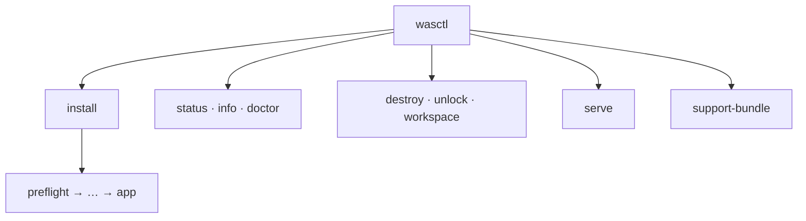

# wasctl CLI reference

```bash
./wasctl --help
./wasctl <command> --help
```




---

## Common flags

| Flag | Purpose |
|------|---------|
| `--cloud aws\|azure` | Target cloud (default `aws`) |
| `--cluster-name` | Workspace / cluster name |
| `--region` | AWS region |
| `--azure-location` | Azure location |
| `--ingress-host` | Ingress DNS hostname |
| `--k8s-version` | Kubernetes version (default: each cloud’s infra `cluster_version`; install offers last 3 minors) |
| `--local` | Use repo `charts/` and `infra/` instead of embedded assets |
| `--no-tui` | Plain text install output (disable the interactive progress UI) |
| `--dry-run` | Plan without applying (where supported) |
| `--skip` | Comma-separated addons to skip (addons stage) |

`NO_COLOR=1` also disables the interactive progress UI.

---

## Commands

| Command | Summary |
|---------|---------|
| `wasctl` / `wasctl install` | Run install (optional stage argument) |
| `wasctl install --all` | All seven stages |
| `wasctl install <stage>` | `preflight`, `bootstrap`, `backend`, `infra`, `kubeconfig`, `addons`, `app` |
| `wasctl status` | Stage completion |
| `wasctl destroy` | Tear down (`--destroy-state-backend` optional) |
| `wasctl doctor` | Diagnostics |
| `wasctl info` | Cluster health summary |
| `wasctl serve` | Web UI (`--port`, `--bind`, `--no-browser`) |
| `wasctl support-bundle` | Diagnostic archive |
| `wasctl config show` | Resolved configuration |
| `wasctl workspace list\|info\|delete` | List, inspect, or delete workspaces |
| `wasctl unlock <name>` | Clear install lock |
| `wasctl version` | Version string |

---

## Install progress UI

In an interactive terminal, `install` shows stage progress as it runs. Disable it with `--no-tui`:

```bash
./wasctl install --all ...
./wasctl install --all --no-tui ...
```

---

## Examples

```bash
./wasctl install --all --cloud azure --azure-location eastus \
  --cluster-name demo --ingress-host demo.eastus.cloudapp.azure.com

./wasctl serve --port 8765
./wasctl doctor
./wasctl destroy
```
