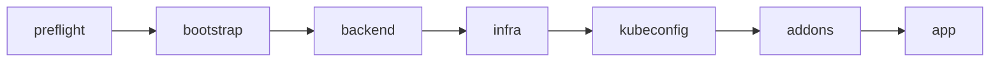
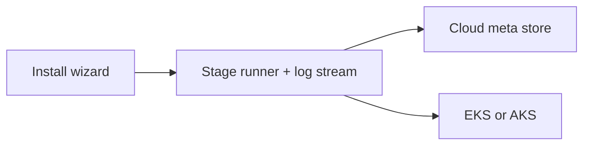
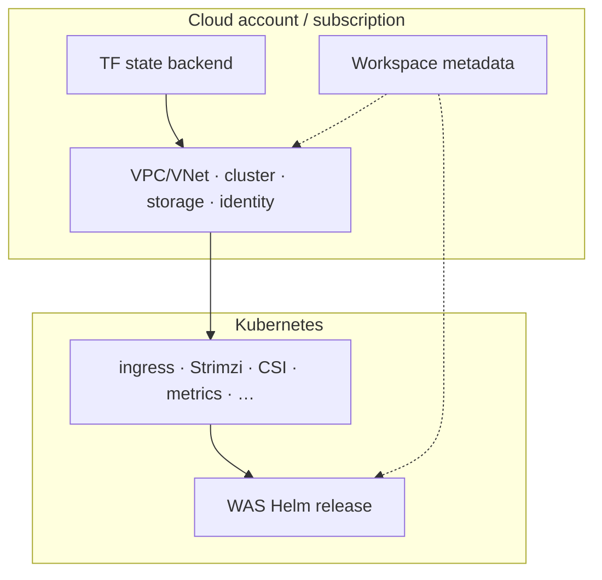
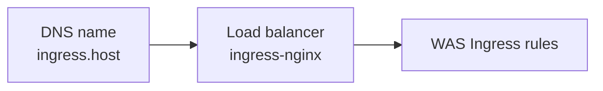

# Install Wolfram Application Server

Use **wasctl** (CLI) or **wasctl serve** (web UI). Prerequisites are in the [root README](../README.md).

A full install usually takes about 35–50 minutes (the infra stage is the longest).




---

## CLI

```bash
./wasctl install --all \
  --cloud aws \
  --region us-east-1 \
  --cluster-name was-prod \
  --ingress-host was.example.com
```

Azure:

```bash
./wasctl install --all \
  --cloud azure \
  --azure-location eastus \
  --cluster-name was-prod \
  --ingress-host was-prod.eastus.cloudapp.azure.com
```

When stdout is a TTY, install shows stage progress as it runs. For plain text output:

```bash
./wasctl install --all --no-tui ...
# or: NO_COLOR=1 ./wasctl install --all ...
```

Resume or re-run a single stage:

```bash
./wasctl install infra
./wasctl install addons --skip cert-manager
./wasctl status
```

---

## Web UI

```bash
./wasctl serve
```

Use the install wizard: choose AWS or Azure, enter the cluster name, region or location, and ingress host, then start the stages. Progress appears in the browser.



---

## What gets created



1. **preflight** — tools and credentials  
2. **bootstrap** — Terraform state backend (S3+DynamoDB or Azure storage)  
3. **backend** — backend config for the stack  
4. **infra** — network, EKS/AKS, shared files, object storage, identity  
5. **kubeconfig** — kubeconfig stored with the workspace (not written to `~/.kube/config`)  
6. **addons** — ingress-nginx, Strimzi, CSI/storage class, metrics, optional cert-manager  
7. **app** — Helm release of the WAS chart  

Installation state is stored in your cloud account, so another machine with the same credentials can continue. Full diagrams: [architecture.md](architecture.md).

---

## Ingress host

| Cloud | Default public name | HTTPS (Let's Encrypt)? |
|-------|---------------------|-------------------------|
| **Azure** | `{label}.{region}.cloudapp.azure.com` | Yes — wasctl enables cert-manager by default |
| **AWS** | `….elb.amazonaws.com` | **No** — ACME refuses `*.amazonaws.com`. Use HTTP on the ELB name, or HTTPS with a **custom** DNS name |

Set `--ingress-host` (or the UI field) to a DNS hostname you control, or Azure’s `*.cloudapp.azure.com` DNS label. Do not use a raw load-balancer IP as the Ingress host on Azure.

**AWS HTTPS:** create `was.example.com` → CNAME to the ELB hostname, then:

```bash
./wasctl install addons --ingress-host was.example.com   # installs cert-manager
./wasctl install app --ingress-host was.example.com
```

Without a custom domain on AWS, wasctl **skips cert-manager** automatically (HTTP only).



After ingress-nginx is up:

```bash
# AWS
kubectl get svc -n ingress-nginx ingress-nginx-controller \
  -o jsonpath='{.status.loadBalancer.ingress[0].hostname}{"\n"}'

# Azure
kubectl get svc -n ingress-nginx ingress-nginx-controller \
  -o jsonpath='{.status.loadBalancer.ingress[0].ip}{"\n"}'
```

Point DNS at that address, or use the Azure DNS label FQDN as `ingress.host`.

---

## Skipping add-ons

If a component is already installed in the cluster:

```bash
./wasctl install addons --skip ingress-nginx,cert-manager
```

Examples: `ingress-nginx`, `strimzi`, `metrics-server`, `prometheus`, `cert-manager`, and cloud-specific CSI drivers. See `wasctl install --help`.

---

## After install

```bash
./wasctl info
./wasctl doctor
```

Activate licensing with the Node Files API (see `docs/API/`).

---

## Helm only

If the cluster and prerequisites already exist, you can install the chart directly — see [charts/wolfram-application-server/README.md](../charts/wolfram-application-server/README.md).

See also: [operations.md](operations.md) · [troubleshooting.md](troubleshooting.md) · [architecture.md](architecture.md)
