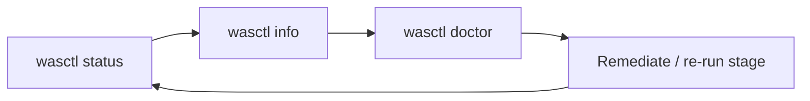
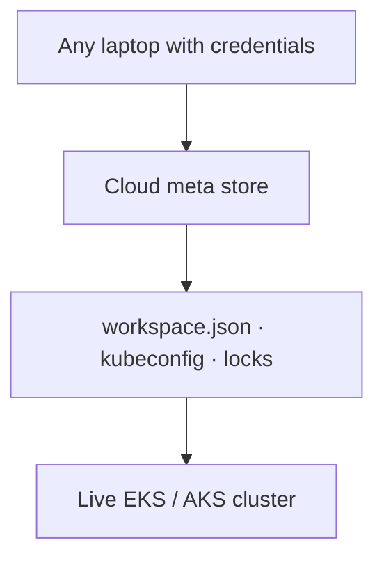

# Operations

Tasks for a cluster installed with wasctl.




---

## Status and health

```bash
./wasctl status              # which stages completed
./wasctl info                # workloads, Kafka, storage
./wasctl doctor              # diagnostic checks
```

In the web UI (`wasctl serve`): select the workspace, then use Overview, Workloads, Kafka, Storage, or Operations → Diagnostics.

---

## Configuration

```bash
./wasctl config show
./wasctl workspace list
./wasctl workspace info <cluster-name>
```

Clear a stuck install lock:

```bash
./wasctl unlock <cluster-name>
```



---

## Upgrade

### Chart / application

```bash
./wasctl install app
# or: helm upgrade — see the chart README
```

With a local checkout of this repo:

```bash
./wasctl install app --local
```

### wasctl binary

Replace the binary. Workspace state remains in your cloud account.

### Infrastructure

Re-run `./wasctl install infra` only when you want Terraform to reconcile. Review the plan carefully; changes can replace nodes or networking.

---

## Support bundle

```bash
./wasctl support-bundle
```

Send the archive to Wolfram support. The web UI Operations tab can generate the same bundle.

---

## Destroy


Destroy reverses the install order (application and add-ons before infrastructure).

```bash
./wasctl destroy
./wasctl destroy --destroy-state-backend   # also delete TF state storage
```

Confirm the cluster name when prompted. In the web UI: Operations → Destroy.

```bash
./wasctl workspace delete <cluster-name>   # remove workspace metadata only
```

---

## Recovery

| Situation | Action |
|-----------|--------|
| Interrupted install | `wasctl status`, then re-run the failed stage |
| Stuck lock | `wasctl unlock <name>` |
| Wrong kubectl context | wasctl does not write `~/.kube/config`; use `wasctl info` or the web UI |
| Addon already exists | `--skip <addon>` on the addons stage |
| Pending Azure log PVCs | Check storage class and Premium share size; delete Pending PVCs before resizing |

See also: [troubleshooting.md](troubleshooting.md) · [architecture.md](architecture.md).
