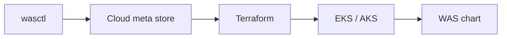

# wasctl documentation

Guides for **wasctl** (CLI) and **wasctl serve** (web UI). AWS EKS and Azure AKS are both supported.




| Guide | Description |
|-------|-------------|
| [install.md](install.md) | First-time install |
| [operations.md](operations.md) | Status, doctor, upgrade, destroy, support |
| [web-ui.md](web-ui.md) | Web UI |
| [cli.md](cli.md) | Commands and flags |
| [troubleshooting.md](troubleshooting.md) | Failures and fixes |
| [architecture.md](architecture.md) | Stages, workspaces, stack overview, and diagrams |

Diagram images live in [images/](images/). Each major diagram also has a Mermaid source in the guides above (renders on GitHub and most Markdown viewers).

Prerequisites are listed in the [root README](../README.md).

```bash
./wasctl install --all --cloud aws --region us-east-1 \
  --cluster-name was-prod --ingress-host was.example.com

./wasctl serve    # http://127.0.0.1:8765
```
