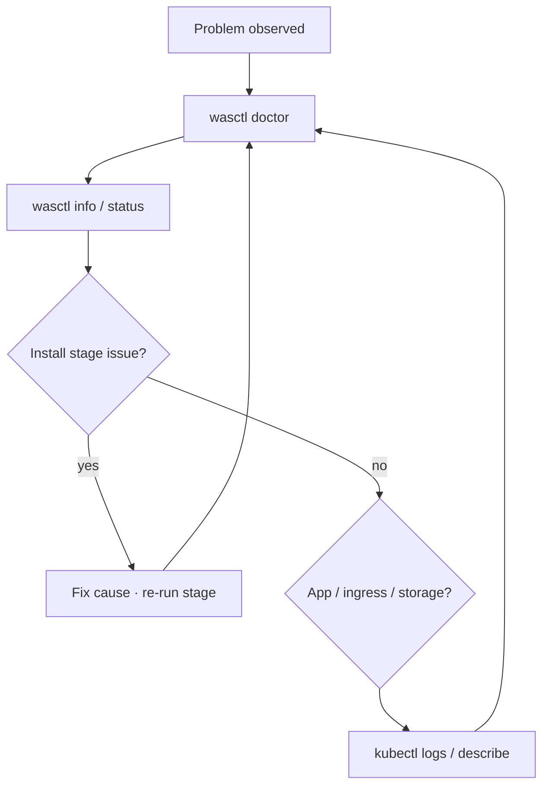

# Troubleshooting

```bash
./wasctl doctor
./wasctl info
./wasctl status
```

Or use Operations → Diagnostics in `wasctl serve`. Checks differ for AWS and Azure.



Architecture overview: [architecture.md](architecture.md). CLI reference: [cli.md](cli.md).

---

## Interactive menu looks empty or wrong

Running `./wasctl` (no subcommand) opens a **cluster-first** menu: it lists workspaces for the current `--cloud`, then lets you install new or work with an existing cluster.

- No clusters listed → credentials / meta store unreachable, or none created yet. You can still choose **Install a new cluster**.
- **Show cluster details** on an incomplete install shows stage progress + workspace metadata (not a blank screen). Live `wasctl info` runs only after the **app** stage is complete.
- Stage status stops probing after the first pending stage (later Helm/kubectl checks are skipped so the menu stays responsive).
- Switch cloud with the menu option, or restart with `./wasctl --cloud azure` / `--cloud aws`.

---

## Kafka PVC Pending (AWS): waiting for ebs.csi.aws.com

`values-aws.yaml` used to set `kafka.storage.class: gp2`. On modern EKS that StorageClass still advertises the **removed** in-tree provisioner `kubernetes.io/aws-ebs`, while the API migrates claims to `ebs.csi.aws.com`. If the EBS CSI driver is not installed, broker PVCs stay Pending.

wasctl now installs `aws-ebs-csi-driver` + StorageClass **`was-kafka-gp3`** and points Kafka at it.

**Unblock a cluster stuck on `gp2` today:**

```bash
# After rebuilding wasctl / applying infra for ebs_csi_driver_role_arn:
./wasctl install infra   # once — creates IRSA role output
./wasctl install addons  # installs EBS CSI + was-kafka-gp3

# Point the chart at the new class and recreate broker claims:
helm upgrade was charts/wolfram-application-server -n was -f values-aws.yaml \
  --reuse-values --set kafka.storage.class=was-kafka-gp3
kubectl -n kafka delete pvc -l strimzi.io/name=kafka-persistent-kafka
# Strimzi recreates PVCs; ensure broker pods restart if needed
kubectl -n kafka delete pod -l strimzi.io/name=kafka-persistent-kafka
```

Or apply the StorageClass by hand and install the CSI driver, then change `kafka.storage.class` as above.

---

## Can't reach the cluster

- Confirm cloud login: `aws sts get-caller-identity` or `az account show`.
- Re-run `wasctl install kubeconfig`, or select the workspace again in the web UI / interactive menu.
- wasctl does **not** use `~/.kube/config`; it keeps an isolated kubeconfig in the workspace.
- On Azure, check AKS API access and network path from your machine (including private clusters).

---

## Install stage failed

| Stage | Common causes |
|-------|----------------|
| preflight | Missing terraform/helm/kubectl/aws/az; wrong cloud login |
| bootstrap | No permission to create state storage; name collision |
| backend | Bootstrap outputs missing; Azure state blob DNS not ready yet |
| infra | Quotas, IAM/RBAC, region capacity; read the Terraform error |
| kubeconfig | Cluster not ready; wrong account / subscription |
| addons | Component AlreadyExists → `--skip` it; transient API errors often retry; ClusterIssuer wait failed |
| app | Missing buckets/identity; invalid Ingress host; PVC Pending; Certificate / TLS not Ready |

Re-run the failed stage after fixing the cause. If the lock is stuck: `wasctl unlock <cluster-name>`.

Prefer `./wasctl install <stage>` or the interactive **Continue** flow so only pending work runs. Confirm the config summary (cloud, buckets, auth mode) before proceeding.

### AWS: `InvalidLaunchTemplateName.AlreadyExistsException` (wasctl-nodes-lt)

Not a Kubernetes version problem. A leftover launch template from a **previous failed apply** (or incomplete destroy) still exists, so CreateLaunchTemplate returns 400.

wasctl now:
- clears the exact-name orphan `${cluster}-nodes-lt` before infra apply when the cluster is missing or has no node groups
- uses `launch_template_use_name_prefix = true` so new LTs do not collide on a fixed name
- records `clusterARN` only after a **successful** apply, and Check requires an ACTIVE cluster with ≥1 node group (so Continue does not skip a partial infra)

Manual unblock if you are mid-flight on an older binary:

```bash
aws ec2 describe-launch-templates --launch-template-names wasctl-nodes-lt --region us-east-1
aws ec2 delete-launch-template --launch-template-name wasctl-nodes-lt --region us-east-1
```

Then re-run infra (`wasctl install infra` / Continue). Rebuild wasctl (or use `--local`) to pick up the Terraform naming fixes.

---

## Addons stays pending after a “successful” run

wasctl treats addons as complete only when required pieces are healthy:

- Helm releases: `ingress-nginx`, `strimzi-kafka-operator`
- StorageClass: `was-efs` (AWS) or `was-azurefile` (Azure)
- metrics-server: Helm release **or** the in-cluster AKS/EKS addon (no Helm release required)

If cert-manager was not skipped, the addons stage also applies ClusterIssuer `letsencrypt-cluster-issuer` and waits until it is Ready.

```bash
./wasctl install addons --cloud <aws|azure> --cluster-name <name>
kubectl get clusterissuer letsencrypt-cluster-issuer
kubectl get sc was-efs was-azurefile 2>/dev/null
```

---

## TLS / cert-manager (HTTPS)

| Cloud | Default | When cert-manager runs |
|-------|---------|-------------------------|
| **Azure** | On | Let's Encrypt works with `*.cloudapp.azure.com` |
| **AWS** | Off (auto-skipped) | Only when `--ingress-host` is a **custom** DNS name (not `*.elb.amazonaws.com`) |

When cert-manager is installed:

1. **addons** creates ClusterIssuer `letsencrypt-cluster-issuer` (Let's Encrypt HTTP-01 via `ingressClassName: nginx`). No ACME email is set (optional in ACME).
2. **app** enables Ingress TLS and deploys Certificate `was-certificate` in namespace `was` (secret `was-tls-secret`, issuer `letsencrypt-cluster-issuer`).

```bash
kubectl get clusterissuer letsencrypt-cluster-issuer
kubectl get certificate,certificaterequest,order,challenge -n was
kubectl describe certificate was-certificate -n was
kubectl get secret was-tls-secret -n was
```

Typical failures:

| Symptom | What to check |
|---------|----------------|
| ClusterIssuer not Ready | cert-manager pods in `cert-manager`; CRDs installed (`crds.enabled=true`) |
| `rejectedIdentifier` / order errored for `*.elb.amazonaws.com` | Let's Encrypt **never** issues for AWS ELB hostnames. Point a DNS name you own at the LB and set `--ingress-host was.example.com` |
| Certificate stuck Issuing | HTTP-01 needs `ingress.host` reachable on port 80 from the public internet |
| Challenge pending | DNS for `ingress.host` must point at the ingress-nginx LoadBalancer |
| No Certificate object | Re-run **app** with a current wasctl/chart (older installs relied on ingress-shim only); on AWS confirm custom `--ingress-host` |
| Skipped cert-manager | App stays HTTP-only; expected on AWS without a custom domain |

### AWS: TLS failed with `rejectedIdentifier` on ELB hostname

Let's Encrypt returns `Cannot issue for "….elb.amazonaws.com": … forbidden by policy`. wasctl therefore **skips cert-manager by default on AWS** unless you pass a custom `--ingress-host`.

Fix for HTTPS on AWS:

```bash
# 1. Get the load balancer hostname
kubectl -n ingress-nginx get svc ingress-nginx-controller \
  -o jsonpath='{.status.loadBalancer.ingress[0].hostname}{"\n"}'

# 2. In your DNS, create was.example.com → CNAME to that hostname

# 3. Install cert-manager + app with your DNS name
./wasctl install addons --cloud aws --ingress-host was.example.com
./wasctl install app --cloud aws --ingress-host was.example.com

# Optional: delete a failed Certificate so cert-manager re-issues cleanly
kubectl -n was delete certificate was-certificate
kubectl -n was delete secret was-tls-secret --ignore-not-found
```

Azure is unchanged: default `*.cloudapp.azure.com` + cert-manager + Let's Encrypt.

Do **not** hand-apply EnvironmentSetup SSL YAMLs when using wasctl — the chart owns `was-certificate`.

---

## Helm install fails: kafka namespace "being terminated"

After `helm uninstall was`, the `kafka` namespace often stays **Terminating** (Strimzi finalizers). Reinstall then fails with:

`kafkas.kafka.strimzi.io "kafka-persistent" is forbidden: unable to create new content in namespace kafka because it is being terminated`

**Unblock now** (your case: 5 KafkaTopics with `strimzi.io/topic-operator`):

```bash
kubectl -n kafka get kafkatopic

# Strip topic-operator finalizers, then delete topics:
kubectl -n kafka get kafkatopic -o name | while read r; do
  kubectl -n kafka patch "$r" --type merge -p '{"metadata":{"finalizers":[]}}'
done
kubectl -n kafka delete kafkatopic --all --force --grace-period=0 --wait=false

# Finalize namespace again if still Terminating:
kubectl get ns kafka -o json | jq '.spec.finalizers=[]' | \
  kubectl replace --raw /api/v1/namespaces/kafka/finalize -f -

kubectl get ns kafka   # should disappear
```

Then re-run `wasctl install app`.

---

## Pods CrashLoopBackOff

```bash
kubectl -n was get pods
kubectl -n was logs <pod> --previous
kubectl -n was describe pod <pod>
```

Check init containers waiting on Kafka, resource-manager, or endpoint-manager. Fix those services first.

---

## Ingress 404 / 502 / no address

- Confirm ingress-nginx has an EXTERNAL IP or hostname.
- `ingress.host` must be a DNS name (on Azure prefer `*.cloudapp.azure.com`, not a raw IP).
- Path type: AWS often `ImplementationSpecific`, Azure often `Prefix` (set in the cloud values files).
- For HTTPS, see [TLS / cert-manager](#tls--cert-manager-https) above.

```bash
kubectl get svc -n ingress-nginx ingress-nginx-controller
kubectl get ingress -n was
```

---

## AWS credentials / IAM

- Refresh keys or the SSO session.
- Use IRSA for Resource Manager (`resourceManager.serviceAccount.roleArn`); static access keys on AWS are deprecated.
- AccessDenied is usually a missing permission, not a missing login — read the action and resource in the error.

---

## Azure credentials / identity

- `az login` and the correct subscription.
- Meta storage: wasctl opens the account with **storage account keys** (needs `listKeys`), not AAD Blob Data Contributor alone.
- **Default** Azure installs use `objectStorage.auth.mode=static` (storage account key for Resource Manager). wasctl sets this from Terraform outputs.
- Workload Identity is **optional**: set `objectStorage.auth.mode=workloadIdentity` and `resourceManager.serviceAccount.azureClientId` to the UAMI client ID (needs Storage Blob Data Contributor on that identity — Owner/UAA or an out-of-band assignment). Infra still creates the UAMI + federated credential for this path.
- The WI webhook / pod labels are only required when mode is `workloadIdentity`.

---

## Kafka unhealthy / Strimzi CrashLoop

```bash
kubectl -n kafka get kafka,kafkabridge,kafkatopic,pods
kubectl -n kafka logs -l strimzi.io/kind=cluster-operator --tail=100
```

- Kafka must be Ready before WAS init containers finish. Re-run addons or app after the operator is healthy.
- Strimzi **&lt; 0.44** can CrashLoop on Kubernetes 1.33+ (fabric8 client). wasctl installs Strimzi ~0.44. Upgrade or re-run addons if an older operator was installed by hand.

---

## PVC Pending / can't mount

- AWS: EFS CSI, `was-efs` StorageClass, and mount targets.
- Azure: `was-azurefile` wired to the Terraform Files storage account; Premium share size must fit the PVC request (chart default log size on Azure is larger than AWS).
- Delete Pending PVCs before changing size, then re-run the app stage.

---

## HPA not scaling / metrics-server

Custom AWES metrics need prometheus-adapter. Without it, custom-metric HPAs fail; CPU and memory metrics still work.

```bash
kubectl describe hpa -n was
kubectl get --raw "/apis/custom.metrics.k8s.io/v1beta1"
kubectl -n kube-system get deploy metrics-server
```

On AKS, metrics-server is often already present as a cluster addon — wasctl skips installing a duplicate Helm release in that case.

---

## Addon AlreadyExists

If an addon was installed outside wasctl, skip it: `--skip <name>`. Persistent AlreadyExists usually means another owner — skip it or remove it carefully by hand.

Examples: `ingress-nginx`, `strimzi`, `metrics-server`, `prometheus`, `cert-manager`, cloud CSI drivers. See `wasctl install --help`.

---

## Chart / Helm notes

- Normal wasctl installs use the **embedded** chart (or `--local` repo files). You do **not** need to publish this chart to a public Helm repo.
- `helm dependency update charts/wolfram-application-server` only refreshes **subchart** archives (ingress-nginx, Strimzi, …) for optional in-chart toggles. wasctl’s addons stage installs those operators itself; leave chart dependency toggles off when addons already ran.
- After editing `charts/wolfram-application-server/`, run `go generate ./internal/assets/` (or `make generate`) before building a non-`--local` wasctl binary.

---

## Terraform destroy hangs (AWS)

Leftover ENIs, security groups, or load balancers can block VPC delete. Remove them, then retry destroy.

---

## Support

```bash
./wasctl support-bundle
```

Include doctor output and the bundle when contacting Wolfram Research.
