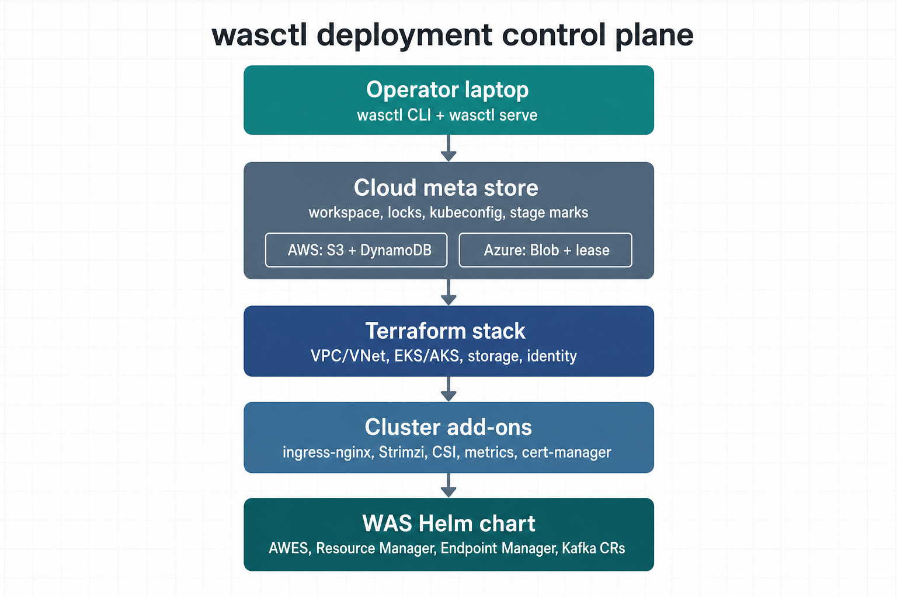
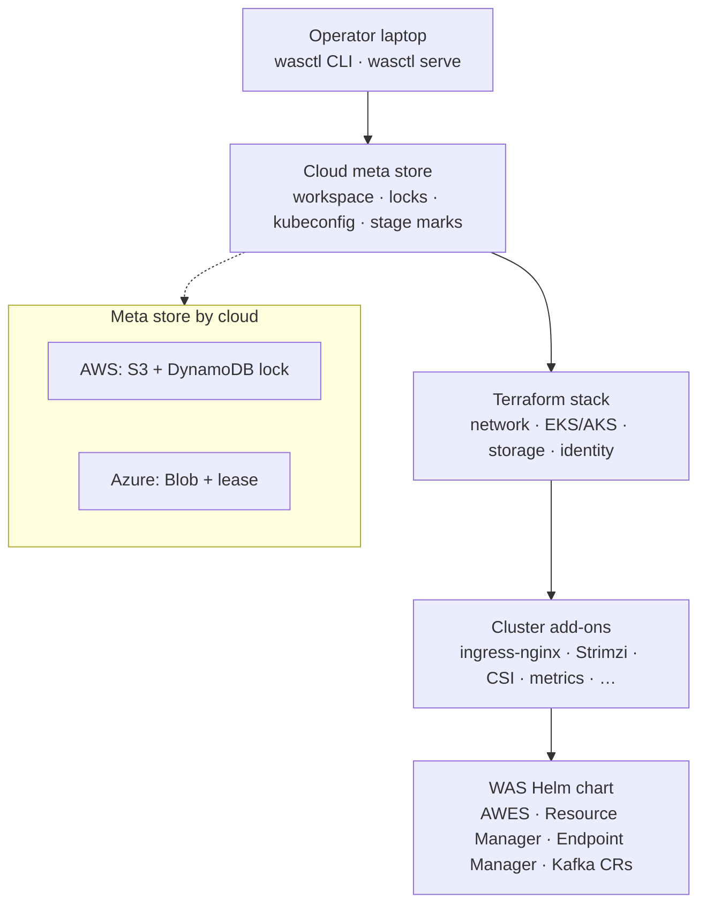
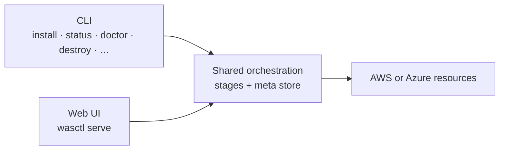
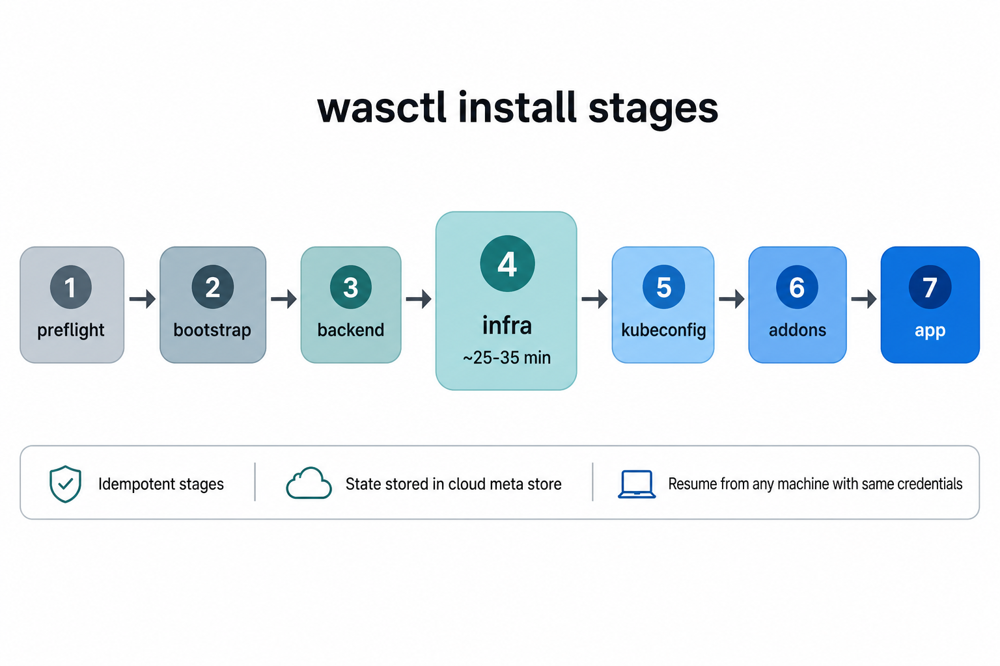
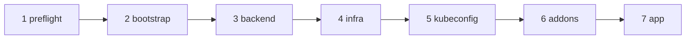
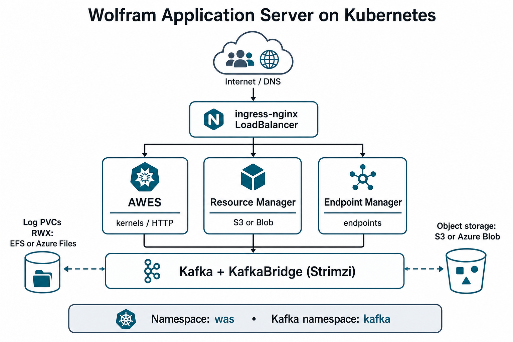
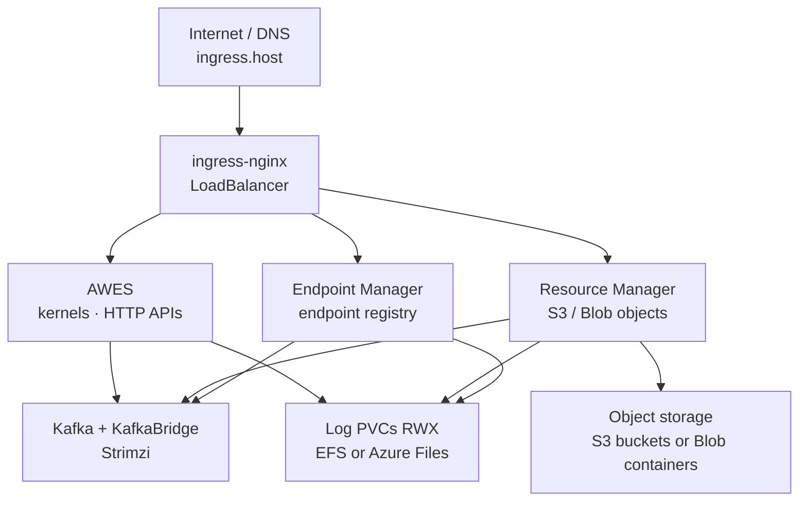
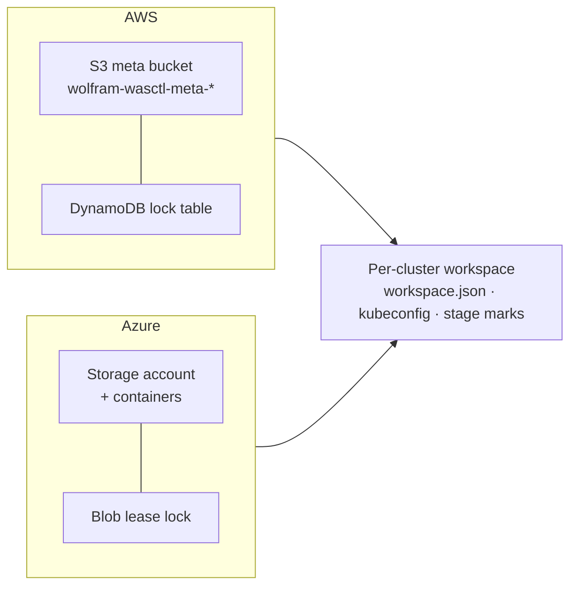

# Architecture

How wasctl deploys Wolfram Application Server on AWS EKS or Azure AKS.

Installation state lives in your cloud account. Any machine with the same credentials can continue an install.

---

## Operator surfaces

wasctl exposes the same workflows through the CLI and a local web UI.

See [cli.md](cli.md) and [web-ui.md](web-ui.md).

---

## Seven stages

| Stage | Output |
|-------|--------|
| preflight | Verified tools and login |
| bootstrap | Remote Terraform state backend |
| backend | Backend configuration in the workspace |
| infra | Cluster, network, buckets/containers, identity |
| kubeconfig | Isolated kubeconfig stored with the workspace |
| addons | Cluster operators and controllers |
| app | WAS Helm release |

Destroy runs these stages in reverse order. Details: [install.md](install.md).

---

## Application stack

| Service | Role |
|---------|------|
| AWES | Wolfram HTTP APIs and kernels |
| Resource Manager | Resource objects in S3 or Blob |
| Endpoint Manager | Endpoint registry |
| Kafka + Bridge (Strimzi) | Messaging between components |

ingress-nginx routes public traffic by path. Shared ReadWriteMany volumes hold logs.

---

## Workspace metadata storage

| Cloud | Storage | Lock |
|-------|---------|------|
| AWS | S3 bucket `wolfram-wasctl-meta-*` | DynamoDB |
| Azure | Storage account and containers | Blob lease |

---

## Notes

- wasctl does not write kubeconfig to `~/.kube/config`.
- Install locks prevent two concurrent installs for the same cluster name.
- Destroy and workspace delete ask for confirmation.
- The web UI has no authentication; bind it to localhost.
