# wasctl web UI

```bash
./wasctl serve
# http://127.0.0.1:8765
# ./wasctl serve --port 9000 --no-browser
```

| Flag | Default | Meaning |
|------|---------|---------|
| `--port` | `8765` | Listen port |
| `--bind` | `127.0.0.1` | Bind address |
| `--no-browser` | off | Do not open a browser automatically |
| `--local` | off | Use chart and infrastructure files from the repository |

The UI has **no login**. Keep it on localhost unless you are on a trusted network.

Screenshots below are optional. Place your own (redacted) PNGs under [`images/webui/`](images/webui/) using the filenames shown. Until then, the placeholders will be missing images — the text still stands alone.

---

## Sitemap

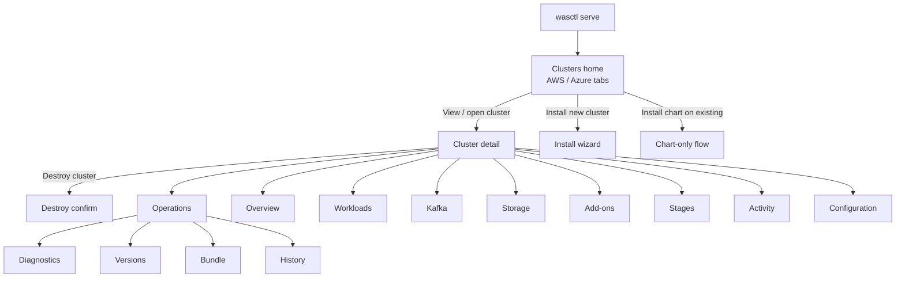

**Global header:** Clusters · Operations  

**Cluster detail tabs:** Overview · Workloads · Kafka · Storage · Add-ons · Stages · Activity · Configuration · Operations  

**Operations sidebar:** Diagnostics · Versions · Bundle · History  

---

## Clusters home

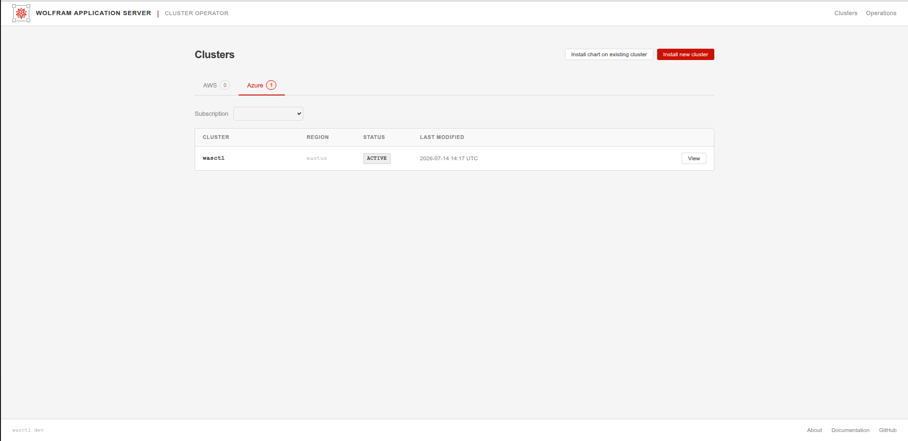

**What it is:** Landing page after `wasctl serve`. Lists known workspaces for the selected cloud.

**What to do:**
1. Choose **AWS** or **Azure**.
2. On Azure, pick the **Subscription** if more than one is available.
3. Click **View** on a cluster row to open its detail page.
4. Click **Install new cluster** to start the guided install wizard.
5. Click **Install chart on existing cluster** only when the cluster already exists and you want the Helm chart path (advanced).

The table shows cluster name, region/location, status (for example ACTIVE), and last modified time.

---

## Cluster detail — Overview

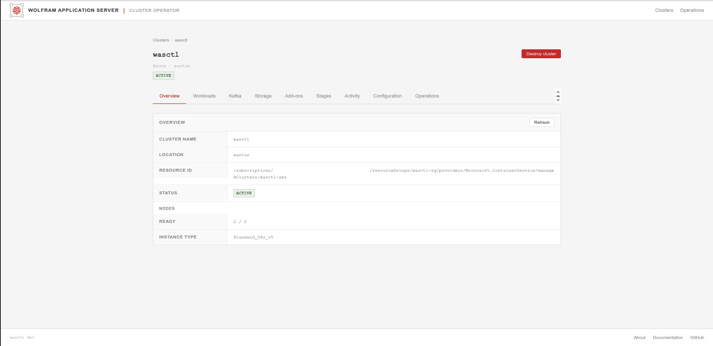

**What it is:** Health snapshot for one workspace: location, status, node readiness, and cloud resource identifiers.

**What to do:**
- Confirm status is **ACTIVE** and nodes are ready (for example `2 / 2`).
- Use **Refresh** after infra or addon changes.
- Use other tabs for deeper detail; use **Destroy cluster** only when you intend to tear the environment down.

---

## Workloads

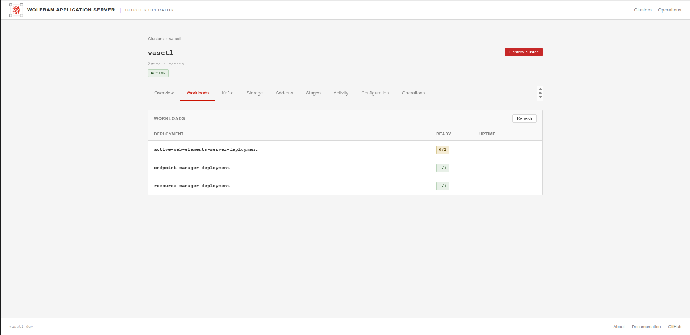

**What it is:** Core WAS Deployments and ready replica counts.

**What to do:**
- Check **READY** for `active-web-elements-server-deployment`, `resource-manager-deployment`, and `endpoint-manager-deployment`.
- Green `1/1` (or more) means the replica set is healthy; `0/1` usually means still starting or failing — check Logs via kubectl or Activity if install just finished.
- Click **Refresh** after scaling or a stage re-run.

---

## Kafka

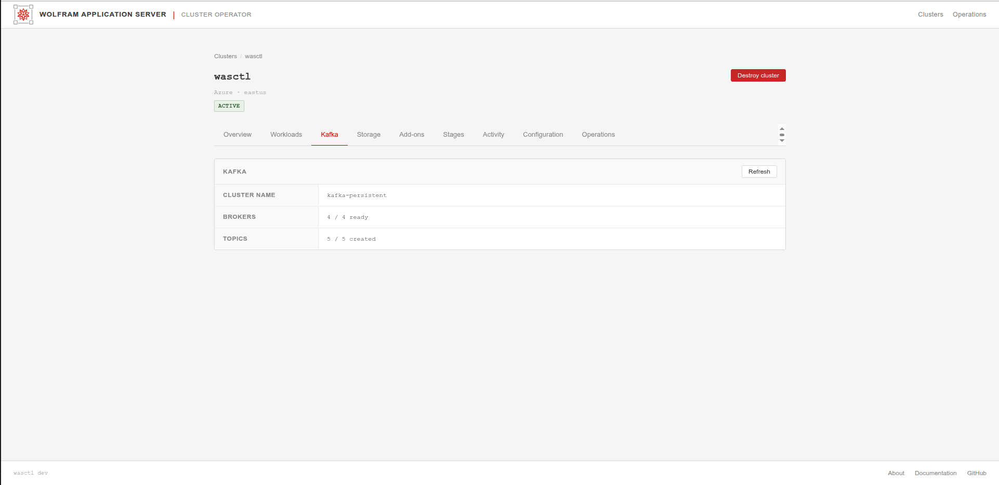

**What it is:** Strimzi Kafka cluster summary for WAS messaging.

**What to do:**
- Confirm brokers are ready (for example `4 / 4 ready`).
- Confirm topics are created (for example `5 / 5 created`).
- If brokers or topics are incomplete, re-check the **Add-ons** / **Stages** tabs or run `wasctl install addons` / `wasctl install app` from the CLI.

---

## Storage

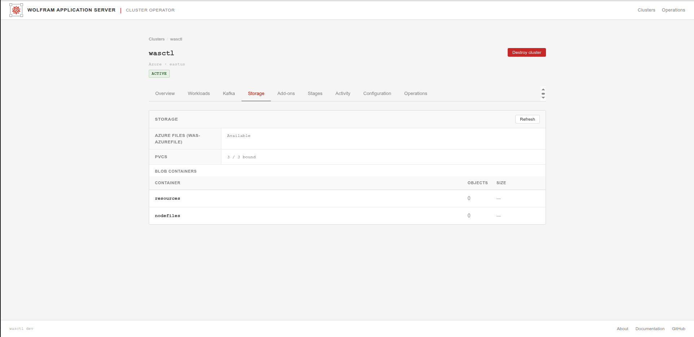

**What it is:** Shared filesystem and object-storage status for the active cloud.

**What to do (Azure example):**
- Confirm **Azure Files** / `was-azurefile` is Available.
- Confirm log **PVCs** are bound (for example `3 / 3 bound`).
- Review **Blob containers** used for resources and nodefiles (object counts/sizes).

On AWS the same tab shows EFS / S3 wording instead of Azure Files / Blob.

---

## Add-ons

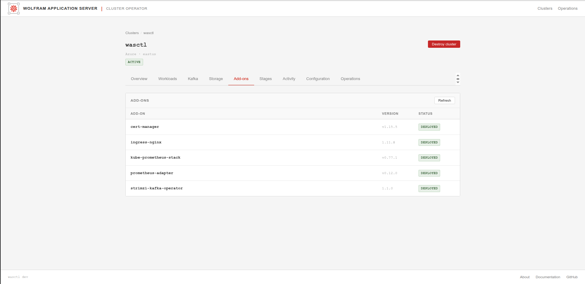

**What it is:** Cluster operators and controllers installed for WAS (ingress-nginx, Strimzi, metrics/prometheus pieces, cert-manager, and so on).

**What to do:**
- Confirm critical add-ons show **DEPLOYED** (or equivalent healthy status).
- Note versions after upgrades.
- If an add-on is missing, use **Stages** to re-run addons, or `wasctl install addons` (with `--skip` for components you manage yourself).

---

## Stages

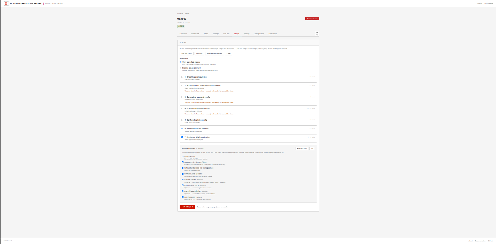

**What it is:** Install and re-run pipeline for the seven wasctl stages, plus optional add-on selection.

**What to do:**
1. Select **Only selected stages** or **From a stage onward**.
2. Tick the stages to run (preflight → bootstrap → backend → infra → kubeconfig → addons → app).
3. Adjust **Add-ons to install** checkboxes if you need to skip or include components.
4. Use **PREVIEW / BUILD** (or the run controls shown in your build) to start; watch progress on the following stream page.

Use this after a partial failure instead of destroying the cluster: re-run from the failed stage.

---

## Activity

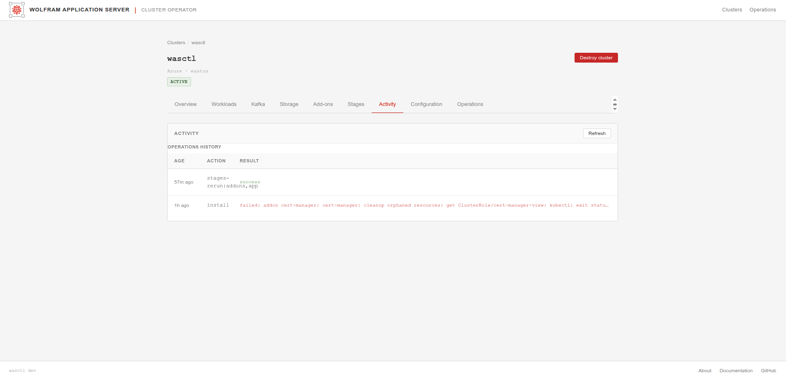

**What it is:** Recent operations log for this workspace (installs, stage re-runs, results).

**What to do:**
- Look for the latest **ACTION** and **RESULT** (`success` vs `failed: …`).
- Use failures here together with Diagnostics when troubleshooting.
- Click **Refresh** after long-running stages finish.

---

## Configuration

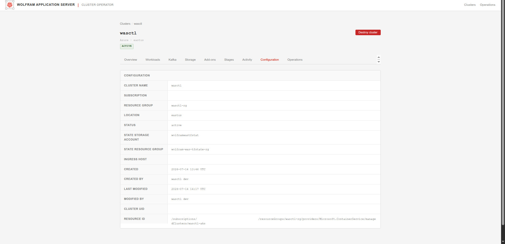

**What it is:** Read-only effective settings for the workspace (cloud account identifiers, resource groups, ingress host, audit timestamps, cluster UID).

**What to do:**
- Verify **ingress host**, location/region, and resource group names match what you expect.
- Copy identifiers only when needed for cloud-console troubleshooting.
- Do not treat this page as an editor — change values via install flags, stages, or Helm, then refresh.

---

## Destroy cluster

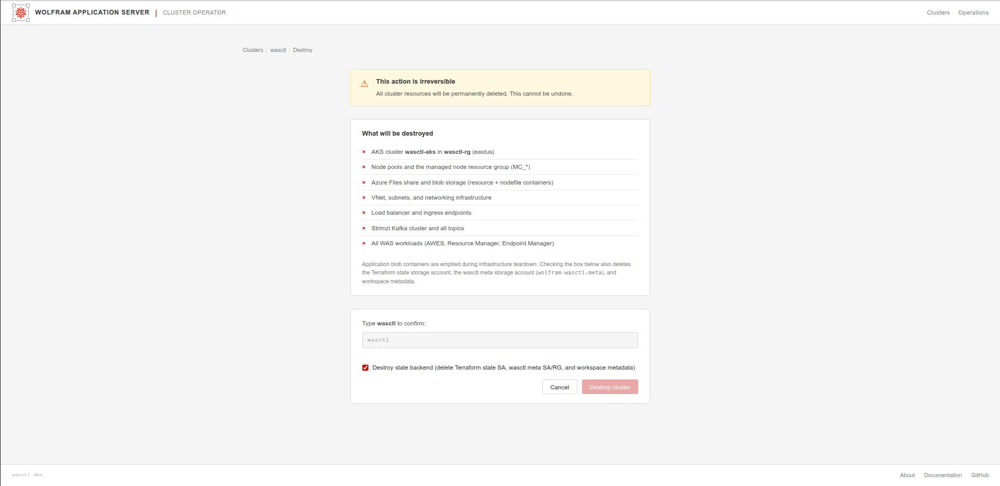

**What it is:** Type-to-confirm teardown of the cluster and related cloud resources.

**What to do:**
1. Read **What will be destroyed** carefully (cluster, networking, storage, Kafka, WAS workloads).
2. Optionally enable **Destroy state backend** if you also want Terraform state / wasctl meta storage removed.
3. Type the **exact cluster name** into the confirmation box.
4. Click **Destroy cluster**, or **Cancel** to leave everything as-is.

This cannot be undone.

### While running

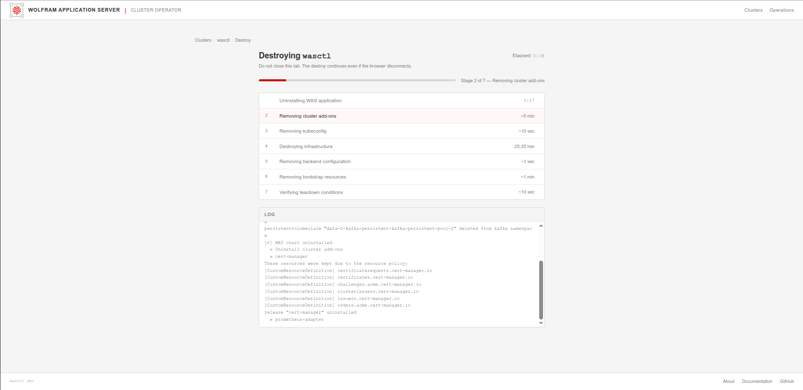

---

## Operations — Diagnostics

### Empty state

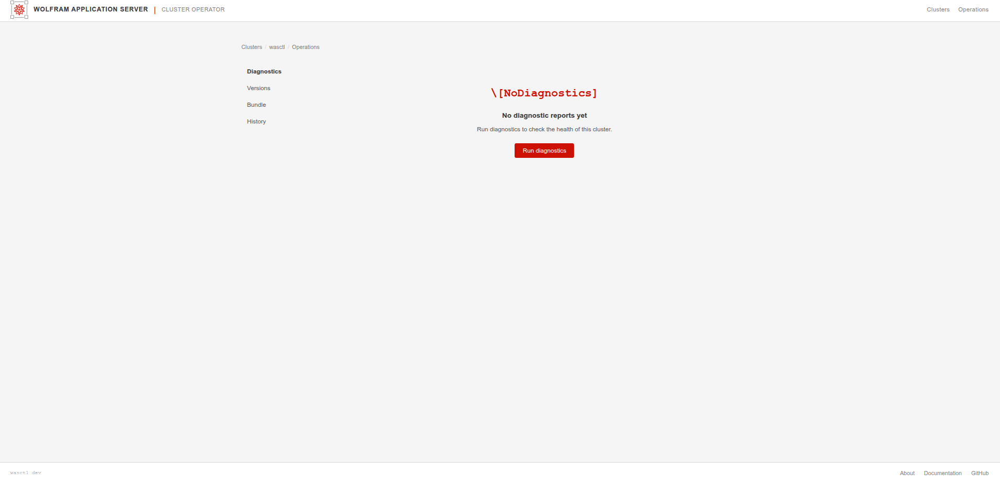

**What to do:** Click **Run diagnostics** to start a doctor run for this cluster.

### While running

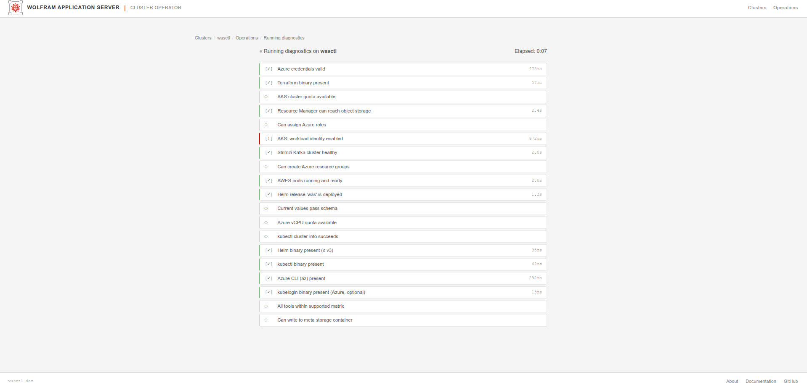

**What to do:** Wait for checks to finish. Passed items show a green check; failures show a red mark with a short message.

### Results

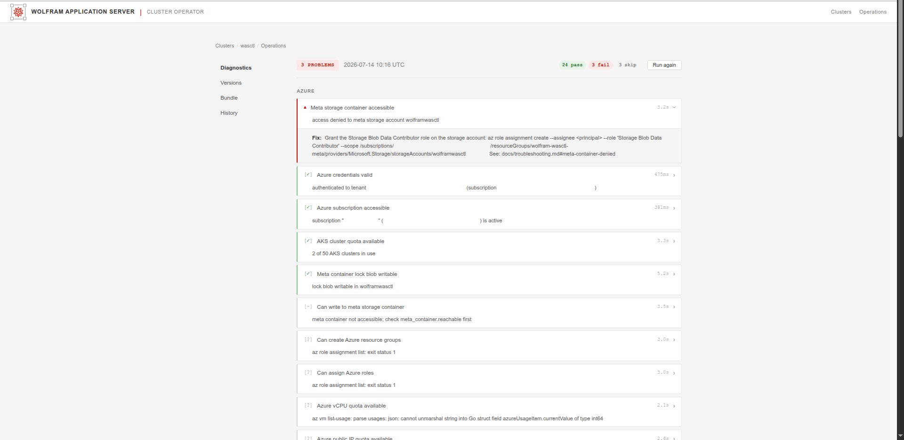

**What to do:**
- Review the summary (pass / fail / skip counts).
- Expand failing checks for the **Fix** guidance.
- Click **Run again** after remediations.
- Prefer a **fresh** run after upgrading wasctl — History can still show older reports with obsolete findings.

Checks are filtered for the active cloud (Azure-only vs AWS-only). Some warnings are informational (for example tool versions slightly above the tested maximum); if the cluster is healthy, treat Critical/Problem items first.

---

## Operations — Versions

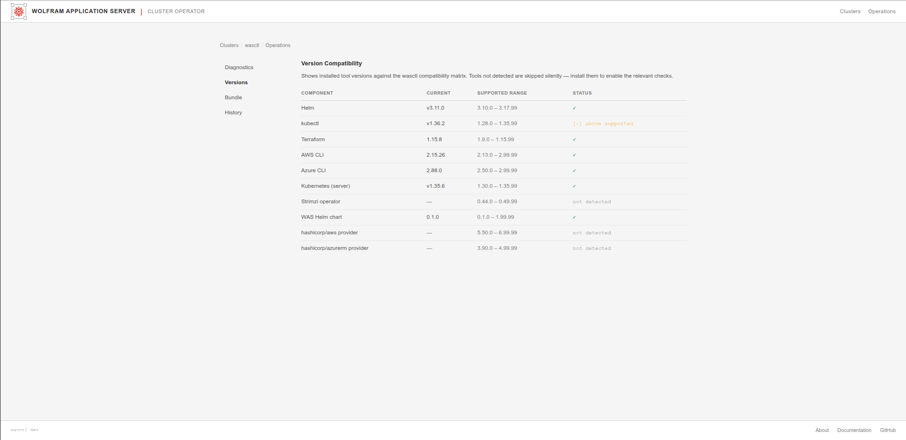

**What it is:** Installed tool/component versions versus the wasctl compatibility matrix.

**What to do:**
- Items marked OK are within the tested range.
- **above supported** means newer than the last tested maximum — often fine, but note it when opening support tickets.
- **not detected** means wasctl could not see that component from this machine (not always an error — for example providers only appear after Terraform init).

---

## Operations — Bundle

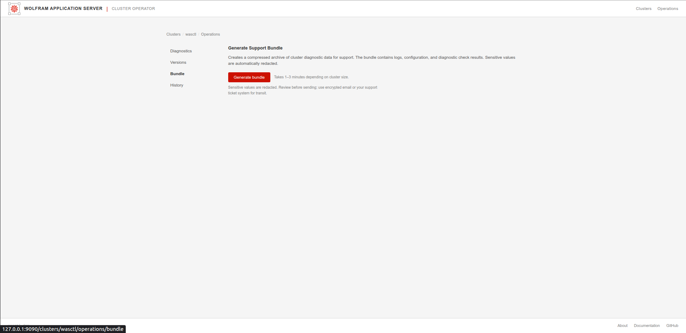

**What it is:** Creates a compressed diagnostics archive for Wolfram support.

**What to do:**
1. Click **Generate bundle** (typically 1–3 minutes).
2. Download when ready.
3. Review before sending; sensitive values are redacted automatically, but you should still check the archive.
4. Send via your usual support channel (preferably encrypted).

Equivalent CLI: `wasctl support-bundle`.

---

## Operations — History

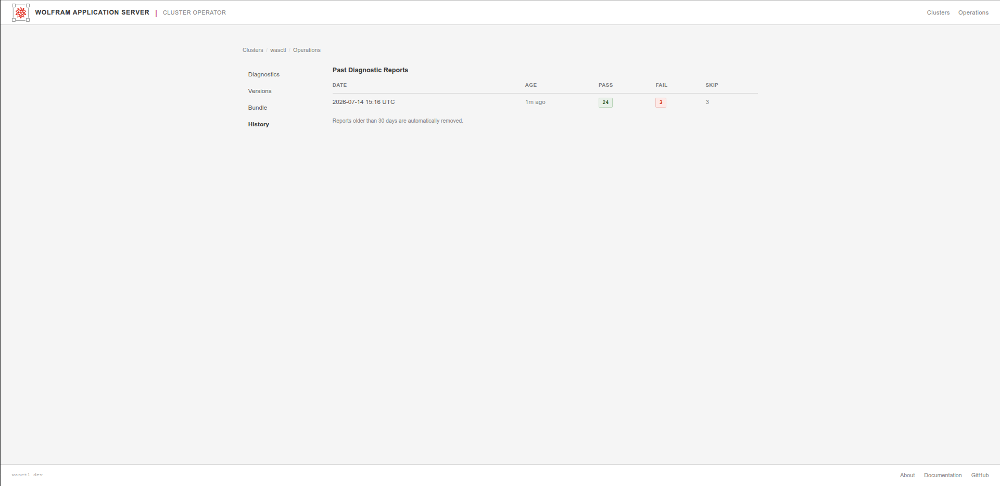

**What it is:** Past diagnostic reports for this cluster (date, age, pass/fail/skip counts).

**What to do:**
- Compare recent runs after changes.
- Remember reports older than **30 days** are removed automatically.
- Open or select a report when the UI offers detail; otherwise re-run Diagnostics for a current picture.

---

See also: [install.md](install.md) · [operations.md](operations.md) · [cli.md](cli.md) · [troubleshooting.md](troubleshooting.md)
